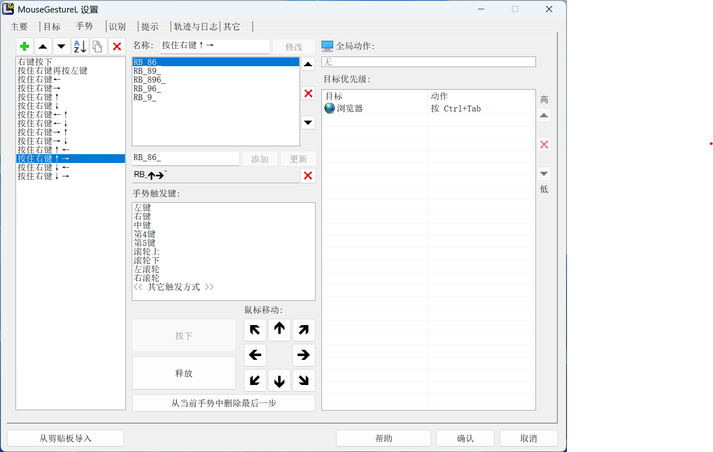
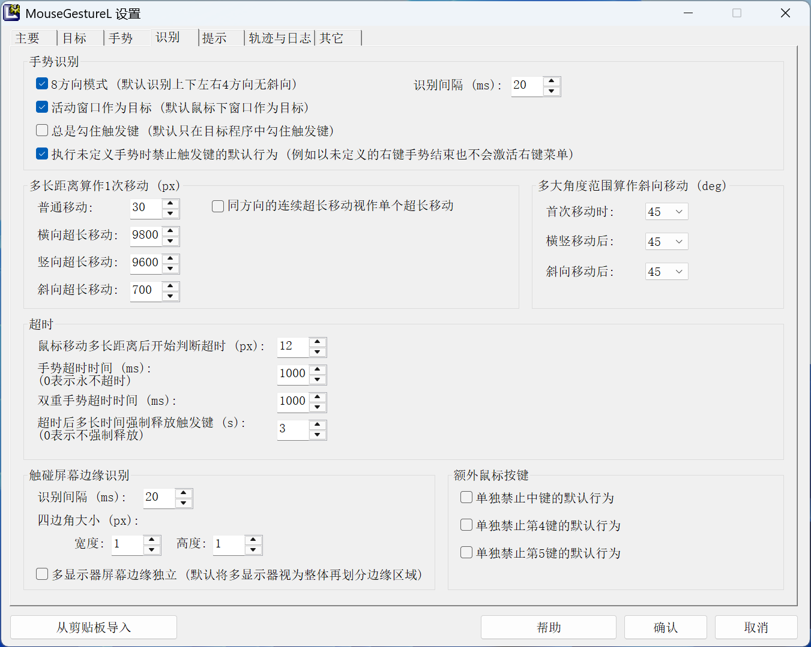
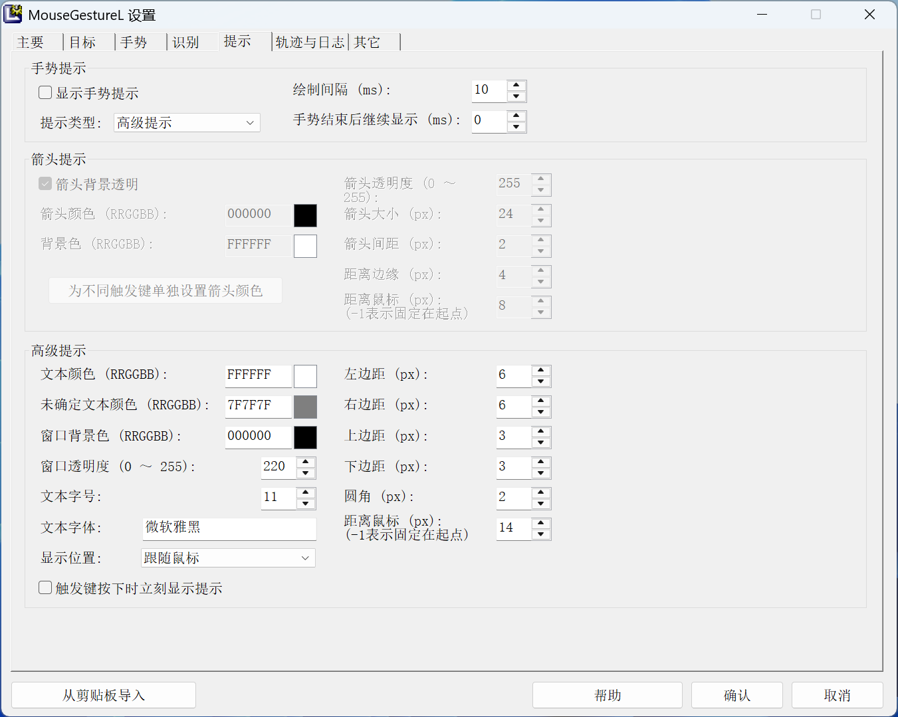
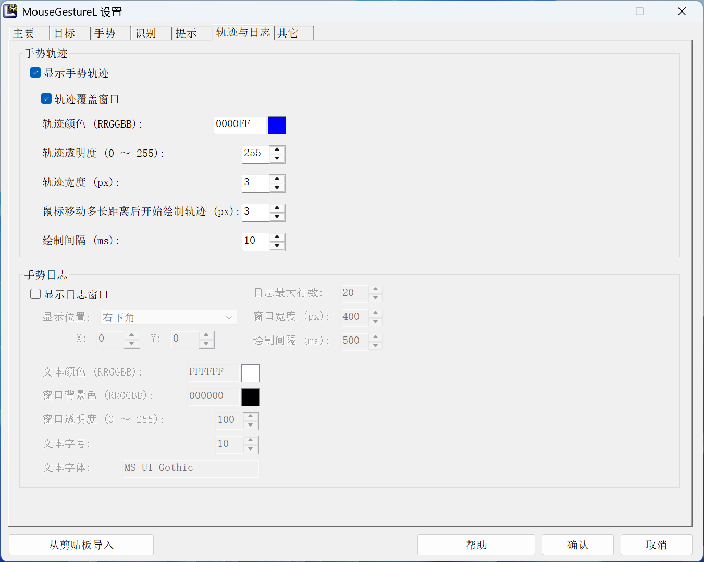

# 鼠标手势 MouseGestureL.ahk 8 方向模式配置

2025-11-06

[TOC]

## 官网

<https://www.autohotkey.com/boards/viewtopic.php?f=6&t=31859>

## 与本机已安装 AutoHotkey v2.0 兼容方式

新建快捷方式，目标为：

```text
C:\Users\用户名\Documents\MouseGestureL\AutoHotkey\AutoHotkeyU64.exe "C:\Users\用户名\Documents\MouseGestureL\MouseGestureL.ahk"
```

## 开机自启动

快捷方式放到如下路径（或 `Win+R` - 运行 - `shell:startup` - 自动打开此目录）：

`C:\Users\用户名\AppData\Roaming\Microsoft\Windows\Start Menu\Programs\Startup`

## 配置






### MouseGestureL\Config\MouseGestureL.ini 部分手势配置参考

```ini
[按住右键←]
G=RB_4_
浏览器=;按 Alt+Right<MG_CR>Send, !{Right}

[按住右键→]
G=RB_6_
浏览器=;按 Alt+Left<MG_CR>Send, !{Left}

[按住右键↑←]
G=RB_84_
G=RB_87_
G=RB_874_
G=RB_74_
G=RB_7_
浏览器=;按 Shift+Ctrl+Tab<MG_CR>Send, +^{Tab}

[按住右键↑→]
G=RB_86_
G=RB_89_
G=RB_896_
G=RB_96_
G=RB_9_
浏览器=;按 Ctrl+Tab<MG_CR>Send, ^{Tab}

[按住右键↓→]
G=RB_236_
G=RB_26_
G=RB_23_
G=RB_36_
G=RB_16_
G=RB_13_
G=RB_1236_
G=RB_123_
G=RB_136_
浏览器=;按 Ctrl+W<MG_CR>Send, ^w
```

EOF
